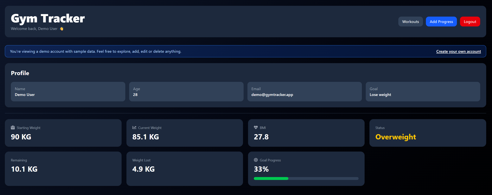
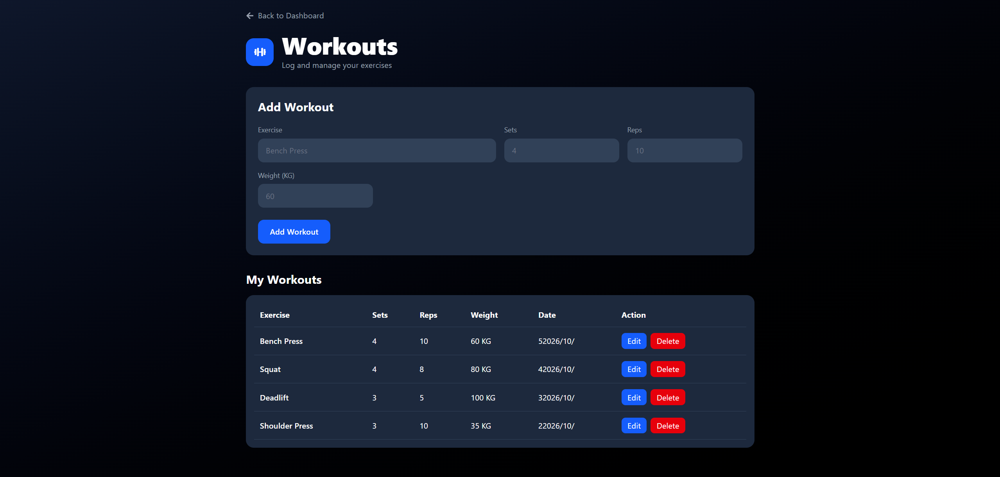
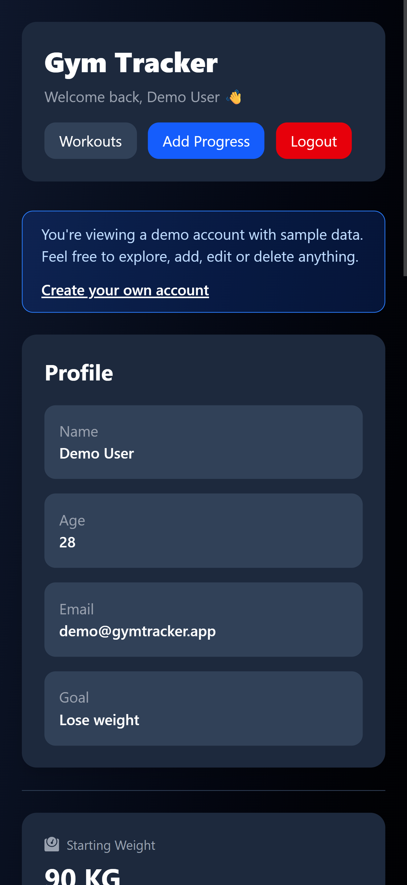

# Gym Tracker 🏋️

A fitness progress tracker where you log your weight, calories, protein and workouts, and follow your progress on charts and stats.

**Live demo:** https://gym-tracker-38c81.web.app/
Click **Try Demo** on the home page to explore with sample data, no sign-up needed.

## Screenshots








## Features

- **Authentication:** register, log in and log out with Firebase Auth. Protected routes keep the dashboard private, and the session survives a page refresh.
- **Dashboard:** starting/current weight, BMI with a color-coded status, remaining weight, weight lost, and a goal progress bar.
- **Weight chart:** line chart of your weight over time (Chart.js).
- **Progress history:** add, edit and delete entries (weight, calories, protein).
- **Workouts:** full CRUD for exercises with sets, reps and weight.
- **Try Demo:** one click creates an anonymous account pre-filled with sample data.
- **Responsive UI:** works on desktop and mobile.
- **Data isolation:** Firestore Security Rules make sure each user can only read and write their own data.

## Tech stack

| Area | Tools |
|---|---|
| Frontend | React, Vite, React Router |
| Styling | Tailwind CSS, React Icons |
| Charts | Chart.js, react-chartjs-2 |
| Backend as a service | Firebase Authentication, Cloud Firestore |
| Hosting | Firebase Hosting |

## Run locally

```bash
git clone https://github.com/BOFAISAL23/GymTracker.git
cd GymTracker
npm install
npm run dev
```

The app uses Firebase. To run your own copy, create a Firebase project, enable **Email/Password** and **Anonymous** sign-in, create a Firestore database, and put your web app config in `src/services/firebase.js`.

Firestore rules used by the app:

```
rules_version = '2';
service cloud.firestore {
  match /databases/{database}/documents {
    match /users/{userId} {
      allow read, write: if request.auth != null && request.auth.uid == userId;
    }
    match /progress/{docId} {
      allow create: if request.auth != null && request.resource.data.userId == request.auth.uid;
      allow read, delete: if request.auth != null && resource.data.userId == request.auth.uid;
      allow update: if request.auth != null && resource.data.userId == request.auth.uid
                    && request.resource.data.userId == request.auth.uid;
    }
    match /workouts/{docId} {
      allow create: if request.auth != null && request.resource.data.userId == request.auth.uid;
      allow read, delete: if request.auth != null && resource.data.userId == request.auth.uid;
      allow update: if request.auth != null && resource.data.userId == request.auth.uid
                    && request.resource.data.userId == request.auth.uid;
    }
  }
}
```

## Deploy

```bash
npm run build
firebase deploy
```

## What I learned

- Handling auth state correctly with `onAuthStateChanged` and protected routes.
- Modeling per-user data in Firestore and securing it with rules.
- Building CRUD flows, a confirmation modal, and a responsive layout with Tailwind.
- Deploying a single-page app to Firebase Hosting.

## Roadmap

- Backend API (Node, Express, JWT) as a separate project.
- Export progress data to CSV.
- Weekly summaries.