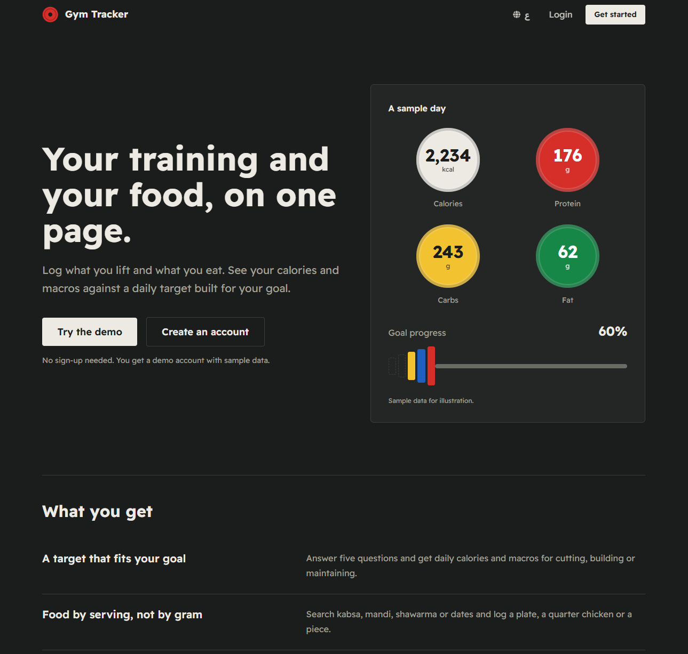
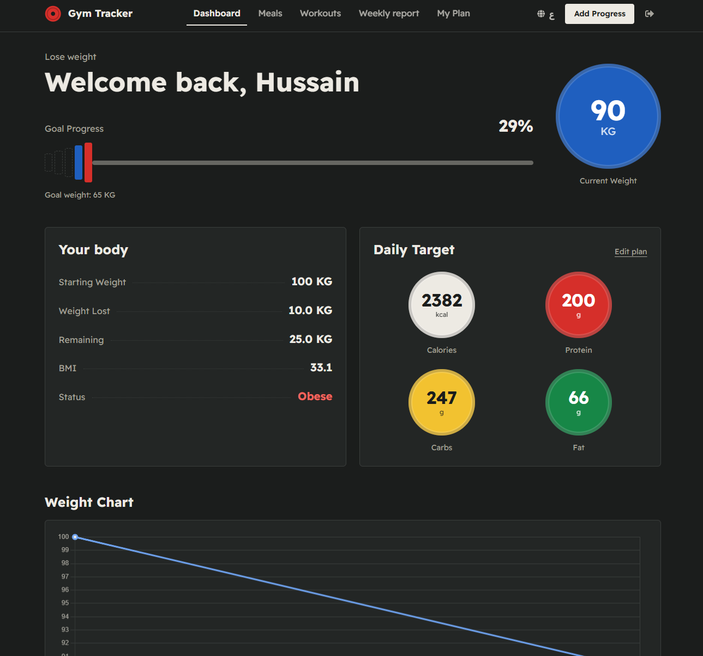
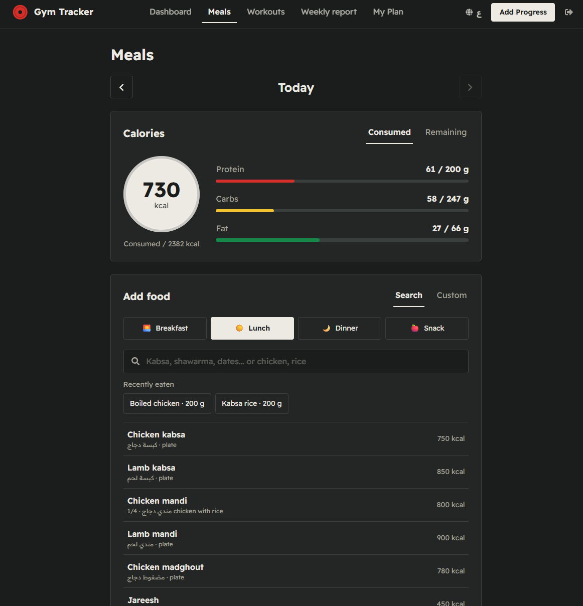
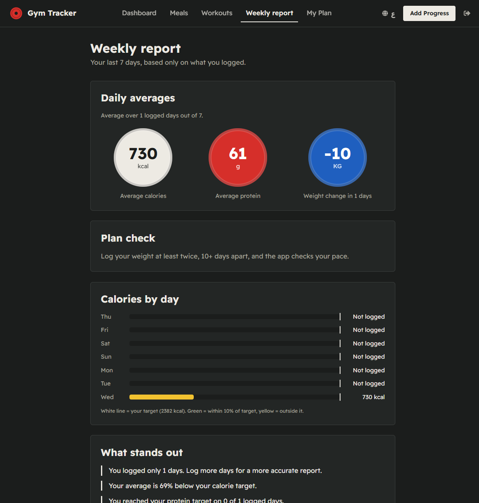
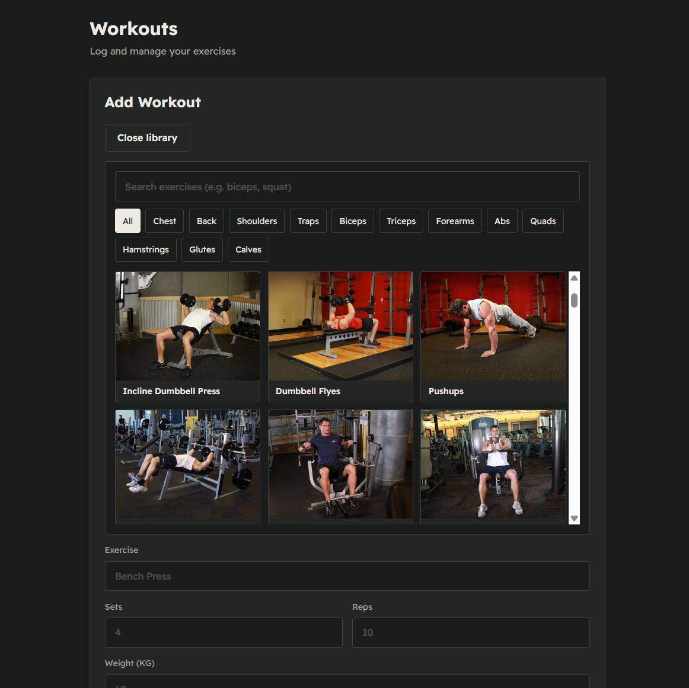
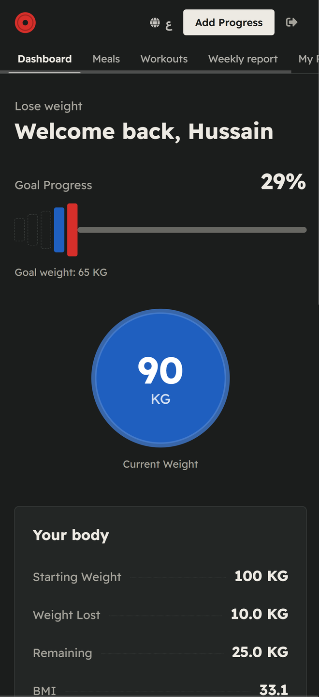

# Gym Tracker 🏋️

A bilingual (Arabic / English) nutrition and training tracker for lifters in the Gulf. Log meals in grams with Saudi and international foods, track your weight and workouts, and get a weekly report that checks whether your plan matches your real results.

**Live:** https://gym-tracker-38c81.web.app/
Click **Try Demo** on the home page to explore with sample data, no sign-up needed.

<p align="center">
  
</p>

<p align="center">
  
</p>

<p align="center">
  
  
</p>

<p align="center">
  
  
</p>

## Features

- **Personal plan:** a short questionnaire (sex, age, height, weight, activity, goal) calculates calories and macros with the Mifflin-St Jeor formula. Goals: cut (-20%), bulk (+10%), maintain.
- **Meals:** log food by grams or by serving from a database of 85 foods (Saudi dishes like kabsa, mandi and jareesh, plus burgers, pizza, pasta and more). Edit amounts, and re-add recent foods or past meals in one tap.
- **Weekly report:** 7-day averages, calories by day against your target, weight change, and plain notes based only on what you logged.
- **Plan check:** compares your real weight trend with a healthy pace for your goal and suggests a small calorie change. Nothing changes until you apply it, and it never suggests again within 14 days.
- **Workouts:** log exercises with sets, reps and weight, or pick from a library of 85 exercises across 12 muscle groups, each with images.
- **Dashboard:** current and starting weight, BMI, progress toward your goal, and a weight chart.
- **Arabic and English:** full translation with right-to-left layout.
- **Google sign-in, email sign-in and a demo mode.**

## Design

A custom "iron plates" visual language: plate colors encode data (calories, protein, carbs, fat) across the whole app, instead of a generic dashboard template.

## Tech stack

| Area | Tools |
|---|---|
| Frontend | React, Vite, React Router |
| Styling | Tailwind CSS, React Icons |
| Charts | Chart.js, react-chartjs-2 |
| Backend as a service | Firebase Authentication (email, Google, anonymous), Cloud Firestore |
| Hosting | Firebase Hosting |

## Run locally

```bash
git clone https://github.com/BOFAISAL23/GymTracker.git
cd GymTracker
npm install
npm run dev
```

To run your own copy, create a Firebase project, enable **Email/Password**, **Google** and **Anonymous** sign-in, create a Firestore database, and put your web app config in `src/services/firebase.js`.

## Security

- Every document belongs to one user. Firestore rules only allow a user to read and write their own data, and validate meal values (name length, calorie and macro ranges).
- React escapes user text, and the app uses no `dangerouslySetInnerHTML`. There is no SQL: Firestore queries are structured.
- The Firebase web API key is public by design. Restrict it to your own domains in Google Cloud Console.

Firestore rules used by the app:

```
rules_version = '2';
service cloud.firestore {
  match /databases/{database}/documents {

    function signedIn() { return request.auth != null; }
    function ownsNew() { return signedIn() && request.resource.data.userId == request.auth.uid; }
    function ownsOld() { return signedIn() && resource.data.userId == request.auth.uid; }

    function validMeal() {
      let d = request.resource.data;
      return d.name is string && d.name.size() > 0 && d.name.size() <= 120
        && d.calories is number && d.calories >= 0 && d.calories <= 20000
        && d.protein is number && d.protein >= 0 && d.protein <= 2000
        && d.carbs is number && d.carbs >= 0 && d.carbs <= 5000
        && d.fat is number && d.fat >= 0 && d.fat <= 2000;
    }

    match /users/{userId} {
      allow read, create, update: if signedIn() && request.auth.uid == userId;
      allow delete: if false;
    }
    match /progress/{docId} {
      allow create: if ownsNew();
      allow read, delete: if ownsOld();
      allow update: if ownsOld() && ownsNew();
    }
    match /workouts/{docId} {
      allow create: if ownsNew();
      allow read, delete: if ownsOld();
      allow update: if ownsOld() && ownsNew();
    }
    match /meals/{docId} {
      allow create: if ownsNew() && validMeal();
      allow read, delete: if ownsOld();
      allow update: if ownsOld() && ownsNew() && validMeal();
    }
  }
}
```

## Deploy

```bash
npm run build
firebase deploy
```

## Known limits

- Nutrition values are approximate and come from typical servings.
- No automated tests yet.
- No AI meal logging (photo, voice or text) yet.

## Roadmap

- Ramadan mode (iftar and suhoor).
- More foods, based on what users search for.
- Delete-my-account and a privacy page.
- Photo, voice and text meal logging with a per-user daily limit.

## Credits

Exercise names and images come from [free-exercise-db](https://github.com/yuhonas/free-exercise-db), released under the Unlicense (public domain).
